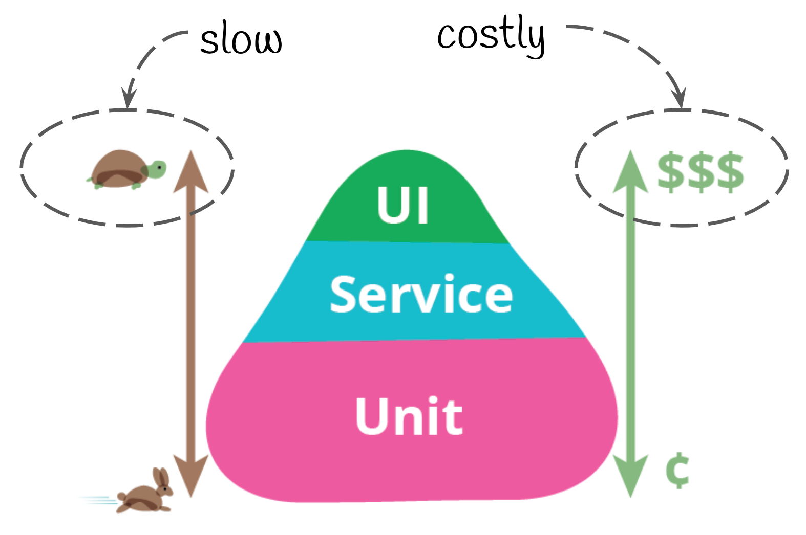

# Ejemplo 2 - Jerarquía de pruebas

## :dart: Objetivos

- Analizar la jerarquía de pruebas
- Reconocer las diferencias entre las pruebas automatizadas y las pruebas manuales

## Desarrollo

### Jerarquía de pruebas

Existen diferentes tipos de tests, cuya principal diferencia radica en lo que buscan probar. Actualmente existen
discrepancias acerca de los nombres que se les dan y los tipos que existen. Por ello y siguiendo a algunos autores los
clasificaremos en tres grandes grupos: test unitarios (unit tests), test de integración (integration tests) y test punta
a punta (E2E por su nombre en Ingles End to End)

#### Tipos de pruebas

Existen diferentes tipos de tests, cuya principal diferencia radica en lo que buscan probar. Actualmente
existen discrepancias acerca de los nombres que se les dan y los tipos que existen. Por ello y siguiendo
a algunos autores los clasificaremos en tres grandes grupos: test unitarios (unit tests), test de
integración (integration tests) y test punta a punta (E2E por su nombre en Ingles End to End)

#### Tests unitarios

Las pruebas unitarias consisten en **aislar una parte del código** (una función, método o clase) y
**comprobar que funciona correctamente**. Son pequeños tests que validan el comportamiento de un
objeto y la lógica.
El unit testing suele realizarse durante la fase de desarrollo de aplicaciones de software o móviles.
Normalmente las llevan a cabo los **desarrolladores**

#### Tests de integración
También denominados por algunos autores como tests funcionales, prueban la interacción entre dos o
más elementos, que pueden ser clases, módulos, paquetes, subsistemas, etc... incluso la interacción del
sistema con el entorno de producción.

#### Tests E2E
Prueban todo el flujo del software desde el punto de vista del usuario final. Prueban el software desde
la interfaz de usuario y no desde el código interno. Están enfocados en detectar posibles problemas que
pudieran encontrar nuestros usuarios en su interacción con el flujo general del programa.
