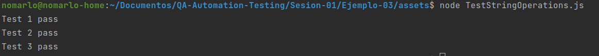

# Ejemplo 3 - Añadir pruebas

## :dart: Objetivos

- Desarrollar pruebas unitarias para una función existente, sin utilizar un framework adicional.


## Desarrollo

Para probar nuestro software no necesitamos ningún framework o librería adicional, bastará con crear otra función que
llame a `castPascalCaseToSnakeCase` y validar su respuesta antes ciertas entradas.

`StringOperations.js`

```javascript
const castPascalCaseToSnakeCase = (pascalCaseString) => {
    return pascalCaseString.split(/(?=[A-Z])/).join('_').toLowerCase();
}

module.exports = {castPascalCaseToSnakeCase};
```

`TestStringOperations.js`

```javascript
const {castPascalCaseToSnakeCase} = require("./StringOperations");


const testCastPascalCaseToSnakeCase = () => {
    castPascalCaseToSnakeCase("EstoEsUnEjemplo") === "esto_es_un_ejemplo" ? console.log("Test 1 pass") : console.log("Test 1 fail")
    castPascalCaseToSnakeCase("otroEjemplo") === "otro_ejemplo" ? console.log("Test 2 pass") : console.log("Test 2 fail")
    castPascalCaseToSnakeCase("otroejemplo") === "otroejemplo" ? console.log("Test 3 pass") : console.log("Test 3 fail")
}


testCastPascalCaseToSnakeCase()
```

Para ejecutar nuestras pruebas necesitamos ejecutar el siguiente comando: `node TestStringOperations.js`


