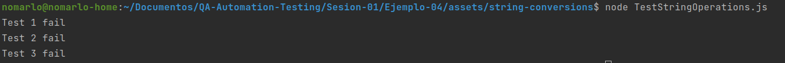

# Ejemplo 4 - Excepciones, fallas y errores

## :dart: Objetivos

- Reconocer las diferencias entre excepciones, fallas y errores

## Desarrollo

### Excepciones, fallas y errores

En el contexto del software nos encontramos con 3 conceptos que a primera vista nos podrían parecer iguales, sin embargo
guardan diferencias importantes, dichos conceptos son: excepción, falla y error. Revisemos a continuación sus
definiciones.

Excepción: mecanismo técnico que se utiliza para abortar la ejecución y dejar que el programa maneje el error o la
falla.

Error: algo inesperado salió mal. Un objeto era nulo, división por cero, etc.

Falla: algo que sabíamos que podía suceder salió mal. La red no funcionaba, un nuevo usuario se registró con un correo
electrónico que ya estaba en uso, etc.

### Representación de errores en pruebas

Actualmente nuestro código de pruebas no nos dará mucha información en caso de que una prueba falle. En caso de una
falla la salida que obtendríamos es la siguiente:



Como podemos observar la salida que obtenemos no es suficiente para ayudarnos a determinar cuál es la causa de la falla.

La información minima que nos gustaría obtener en caso de una falla es la siguiente:

- salida esperada
- salida obtenida

Vamos a realizar un pequeño refactor a nuestras pruebas para que podamos obtener la información que necesitamos en caso
de falla

Partiendo del siguiente código:

`TestStringOperations.js`

```javascript
const {castPascalCaseToSnakeCase} = require("./StringOperations");


const testCastPascalCaseToSnakeCase = () => {
    castPascalCaseToSnakeCase("EstoEsUnEjemplo") === "esto_es_un_ejemplo" ? console.log("Test 1 pass") : console.log("Test 1 fail");
}


testCastPascalCaseToSnakeCase()
```

Pasaremos a lo siguiente

```javascript
const {castPascalCaseToSnakeCase} = require("./StringOperations");


const testCastPascalCaseToSnakeCase = () => {
    const pascalCaseString = "EstoEsUnEjemplo";
    const expectedSnakeCaseString = "esto_es_un_ejemplo";
    const actualSnakeCaseString = castPascalCaseToSnakeCase(pascalCaseString);
    if (actualSnakeCaseString !== expectedSnakeCaseString) {
        console.log(`Test fail expected output: ${expectedSnakeCaseString}  actual output: ${actualSnakeCaseString}`)
    } else {
        console.log("Test pass")
    }
}


testCastPascalCaseToSnakeCase()
```

Con el código anterior obtendremos la información que necesitamos en caso de que una prueba falle sin embargo tendremos
que repetir dicha estructura para cada uno de los casos de prueba, haciendo de cada función algo muy engorroso.

¿Cómo podríamos mejorarlo?

Realizaremos una mejor implementación durante nuestro siguiente reto  
