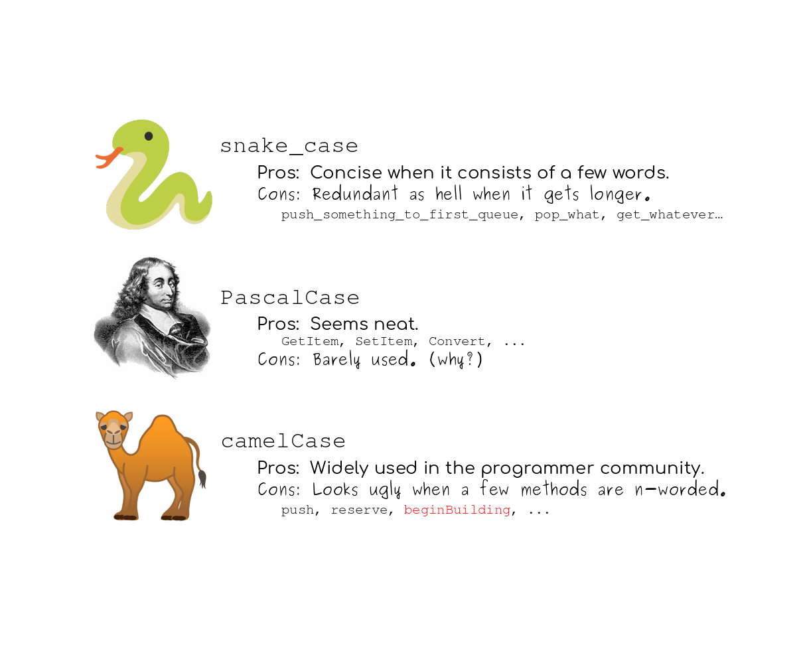

# Reto 1 - Implementar conversión de PascalCase a snake_case

## :dart: Objetivos

- Analizar requerimientos y escribir código que los satisfaga de manera adecuada.

## ⚙ Requisitos

- WebStorm
- Node.js

## Desarrollo



Queremos realizar un programa que sea capaz de convertir una cadena en formato PascalCase (EstoEsUnEjemplo) a formato
snake_case(esto_es_un_ejemplo). Para ello contaremos con la siguiente función:

`castPascalCaseToSnakeCase(pascalCaseString: string) → string`

1. Crea un nuevo archivo llamado StringOperations.js
2. Añade una función llamada: `castPascalCaseToSnakeCase` que recibira como parametro una cadena en formato PascalCase
3. La función debe regresar la cadena convertida en formato snake_case. Ejemplo: HolaMundo -> hola_mundo
4. Ejecuta tu programa con node


<details>
  <summary>Solución</summary>
  
  1. Utilizando la función split partiremos nuestra cadena en fragmentos cada que exista una letra mayuscula. Ejemplo: ['Hola', 'Mundo']
  2. Con join uniremos el array resultante utilizando el guion bajo como "pegamento". Ejemplo: 'Hola_Mundo'
  3. Por ultimo convertiremos todo el string resultante a minusculas. Ejemplo: 'hola_mundo'

`StringOperations.js`
```javascript

const castPascalCaseToSnakeCase = (pascalCaseString) => {
    return pascalCaseString.split(/(?=[A-Z])/).join('_').toLowerCase();
}

```
</details>

