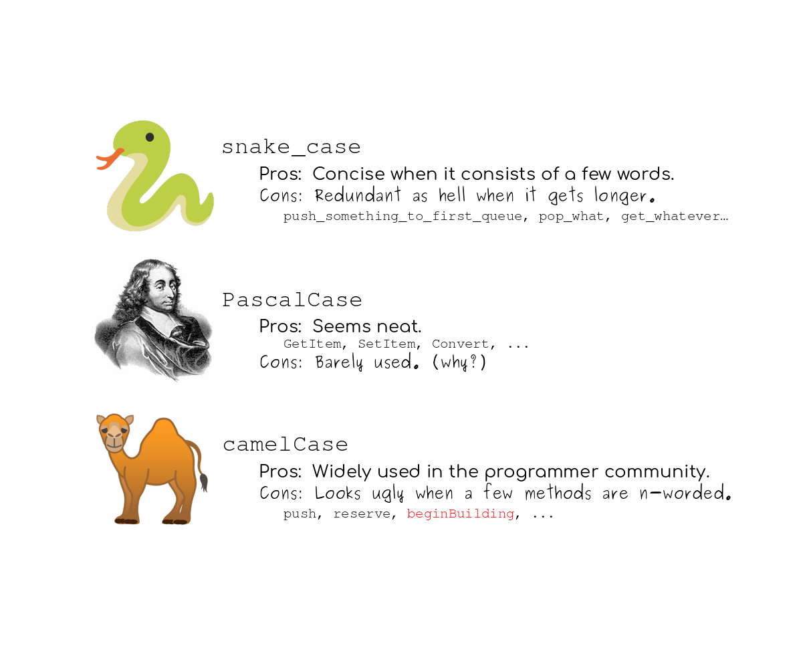

# Reto 2 - Implementar conversión de snake_case a PascalCase

## :dart: Objetivos

- Analizar requerimientos y escribir código que los satisfaga de manera adecuada.
- Escribir pruebas unitarias que validen requerimientos dados


## Desarrollo



Queremos realizar un programa que sea capaz de convertir una cadena en formato snake_case(esto_es_un_ejemplo) a formato
PascalCase (EstoEsUnEjemplo). Para ello contaremos con la siguiente función:

`castSnakeCaseToPascalCase(snakeCaseString: string) → string`

Adicionalmente debemos añadir pruebas a nuestro código.


1. En el archivo llamado StringOperations.js añade una función llamada: `castSnakeCaseToPascalCase` que recibira como parametro una cadena en formato snake_case
2. La función debe regresar la cadena convertida en formato PascalCase. Ejemplo: hola_mundo -> HolaMundo
3. En el archivo llamado TestStringOperations.js añade las pruebas correspondientes
4. Ejecuta tu programa y las pruebas con node


<details>
  <summary>Solución</summary>

  1. Utilizando la función split partiremos nuestra cadena en fragmentos cada que exista un guión bajo. Ejemplo: ['hola', 'mundo']
  2. Con map uniremos el array resultante, convirtiendo el primer caracter de cada palabra en mayuscula.Ejemplo: 'HolaMundo'
  
`StringOperations.js`

```javascript

const castPascalCaseToSnakeCase = (pascalCaseString) => {
    return pascalCaseString.split(/(?=[A-Z])/).join('_').toLowerCase();
}

const castSnakeCaseToPascalCase = (snakeCaseString) => {
    const words = snakeCaseString.split('_');
    return words.map(word => word[0].toUpperCase() + word.substr(1)).join('');
}

module.exports = {castPascalCaseToSnakeCase, castSnakeCaseToPascalCase};

```

`TestStringOperations.js`

```javascript

const {castPascalCaseToSnakeCase, castSnakeCaseToPascalCase} = require("./StringOperations");


const testCastPascalCaseToSnakeCase = () => {
    castPascalCaseToSnakeCase("EstoEsUnEjemplo") === "esto_es_un_ejemplo" ? console.log("Test 1 pass") : console.log("Test 1 fail")
    castPascalCaseToSnakeCase("otroEjemplo") === "otro_ejemplo" ? console.log("Test 2 pass") : console.log("Test 2 fail")
    castPascalCaseToSnakeCase("otroejemplo") === "otroejemplo" ? console.log("Test 3 pass") : console.log("Test 3 fail")
}

const testCastSnakeCaseToPascalCase = () => {
    castSnakeCaseToPascalCase("esto_es_un_ejemplo") === "EstoEsUnEjemplo" ? console.log("Test 1 pass") : console.log("Test 1 fail")
    castSnakeCaseToPascalCase("otro_ejemplo") === "OtroEjemplo" ? console.log("Test 2 pass") : console.log("Test 2 fail")
    castSnakeCaseToPascalCase("otroejemplo") === "Otroejemplo" ? console.log("Test 3 pass") : console.log("Test 3 fail")
}


testCastPascalCaseToSnakeCase();
testCastSnakeCaseToPascalCase();


```

</details>

