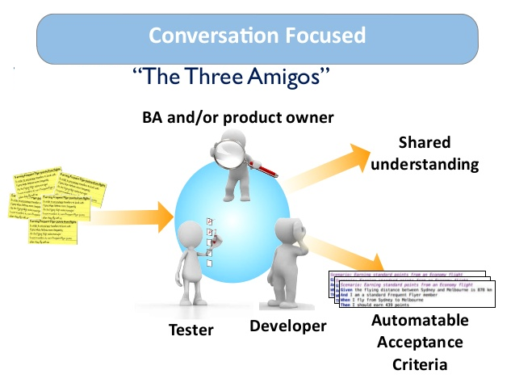

# Ejemplo 1 - Métodos agiles de pruebas

## :dart: Objetivos

- Identificar las tareas y responsabilidades de un tester en un proceso de desarrollo ágil
- Identificar las características de TDD y BDD

## Desarrollo

Como se mencionó anteriormente, el desarrollo guiado por pruebas (TDD) es una técnica de programación ágil que requiere
que los desarrolladores, antes de escribir cualquier unidad de código, escriban una prueba automatizada para ese código.
Escribir las pruebas automatizadas es importante porque obliga al desarrollador a tener en cuenta todas las posibles
entradas, errores y salidas. TDD permite que un equipo ágil realice cambios en la base de código de un proyecto y luego
pruebe de manera rápida y eficiente los nuevos cambios ejecutando las pruebas automatizadas. El resultado de usar TDD es
que los equipos ágiles acumularán un conjunto completo de pruebas unitarias que se pueden ejecutar en cualquier momento
para proporcionar comentarios de que su software aún está funcionando. Si el nuevo código rompe algo y hace que falle
una prueba, TDD también hace que sea más fácil identificar el problema y corregir el error.

### Desarrollo Dirigido por Comportamiento (_Behavior-Driven Development_ o _BDD_)

El desarrollo impulsado por el comportamiento (BDD) es una extensión del desarrollo dirigido por pruebas (TDD) que
fomenta la colaboración entre desarrolladores, QA y participantes no técnicos o comerciales en un proyecto de software.
Extiende TDD escribiendo casos de prueba en un lenguaje natural llamado Gherkin que los no programadores y los expertos
en el dominio pueden leer. Las características de BDD generalmente se definen en un formato DADO (GIVEN) CUÁNDO (WHEN) y
ENTONCES (THEN) (GWT), que es una forma semi-estructurada de escribir casos de prueba. Una característica o historia de
usuario de BDD debe seguir la siguiente estructura:

- Describe quién es el principal interesado de la función.
- ¿Qué efecto quiere la parte interesada que tenga la función?
- ¿Qué valor comercial obtendrá el interesado de este efecto?
- Criterios o escenarios de aceptación

Un breve ejemplo de una función BDD en este formato se ve así:
Característica: los artículos en carritos de compras abandonados deben devolverse al inventario Para realizar un
seguimiento del inventario Como propietario de una tienda en línea Quiero volver a agregar artículos al inventario
cuando se abandona un carrito de compras en línea.

Escenario 1: Los artículos del carrito de compras en línea que no se compran en 30 minutos vuelven al inventario Dado
que (Given) un cliente pone un suéter negro en su carrito de compras Y tengo tres suéteres negros en inventario.
Cuando (When) no completa la compra con 30 minutos (es decir, abandona el carrito de compras)
Entonces (Then) debería tener cuatro suéteres negros en inventario.

En TDD, los desarrolladores escriben las pruebas, mientras que en BDD las especificaciones automatizadas son creadas por
usuarios o probadores (con los desarrolladores escribiendo el código subyacente que implementa la prueba). Una mejor
práctica clave de BDD es usar Specification by Example, un enfoque colaborativo para definir los requisitos y las
pruebas funcionales orientadas al negocio para productos de software basadas en capturar e ilustrar los requisitos
utilizando ejemplos realistas en lugar de declaraciones abstractas.

Las historias de usuario, que describimos anteriormente, se utilizan en el desarrollo ágil para ayudar a cambiar el
enfoque en los proyectos de software de escribir sobre los requisitos de software a hablar sobre ellos. Las historias de
usuario no son documentos formales como lo son los requisitos tradicionales. Están destinados a ser marcadores de
posición para las conversaciones entre las partes interesadas en un proyecto con el fin de llegar a un acuerdo sobre los
criterios de aceptación para una función en particular. Otra práctica recomendada para fomentar este tipo de
conversación sobre la funcionalidad es utilizar reuniones de "Tres amigos" que involucren a un propietario de producto (
o un analista de negocios), un desarrollador y un evaluador de control de calidad, que se reúnan para revisar los
requisitos, pruebas y dependencias de una solicitud de función en el backlog.

