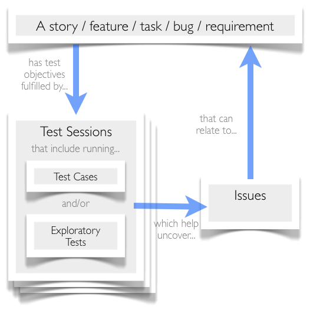

# Ejemplo 3 - Otras metodologías de pruebas agiles

## :dart: Objetivos

- Identificar las tareas y responsabilidades de un tester en un proceso de desarrollo ágil
- Reconocer las diferentes metodologías de pruebas ágiles

## Desarrollo

### Exploratory Testing

Las pruebas exploratorias son pruebas en las que el evaluador controla activamente el diseño de las pruebas a medida que
se realizan y utiliza la información obtenida durante las pruebas para diseñar nuevas y mejores pruebas. Las pruebas
exploratorias se realizan de una manera más libre que las pruebas con guiones, donde los casos de prueba se diseñan de
antemano. Las pruebas exploratorias son importantes en los proyectos ágiles, ya que los desarrolladores y otros miembros
del equipo a menudo se acostumbran a seguir un proceso definido (como los dictados por los enfoques de prueba TDD, BDD o
ATDD) y pueden dejar de pensar fuera de la caja. Debido al deseo de un consenso rápido entre los equipos ágiles
autoorganizados (incluso los distribuidos globalmente), la colaboración puede convertirse en pensamiento grupal. Las
pruebas exploratorias combaten esta tendencia al permitir que un miembro del equipo juegue el papel de "abogado del
diablo" y haga preguntas difíciles de prueba del tipo "qué pasaría si".

Un ejemplo de prueba exploratoria en un sitio web de compras en línea probaría la siguiente funcionalidad desde la
perspectiva de un usuario final (en cualquier orden que elija el evaluador): inicio de sesión, lista de productos, carga
y descarga de un carrito de compras, procesamiento de pagos , Historial de pedidos y envío de productos.

Las pruebas exploratorias son especialmente útiles en situaciones de prueba complejas, cuando se sabe poco sobre el
producto o como parte de la preparación de un conjunto de pruebas programadas. La complejidad de las aplicaciones
modernas dificulta que las pruebas manuales o automatizadas prescritas encuentren todos los casos extremos necesarios
para capturar por completo la experiencia del usuario final. Las pruebas exploratorias se destacan al permitir que los
no evaluadores pasen por una aplicación y proporcionen datos claros, capturados y anotados para que su equipo replique
cualquier problema que se encuentre.

Debido a que las pruebas exploratorias son un proceso que requiere mucho tiempo, una mejor práctica requiere que el
propietario del proyecto asigne tiempo suficiente para que el evaluador pueda comprender los requisitos comerciales y el
propósito de la aplicación que se está probando. Los evaluadores también deben usar herramientas de prueba y otros
recursos que puedan ayudar a documentar cualquier error encontrado de una manera clara y concisa para que los
desarrolladores puedan recrear y corregir el error. Las pruebas exploratorias se realizan mejor en un entorno
colaborativo donde los evaluadores trabajan en estrecha colaboración con los desarrolladores.

### Session-Based Testing

Las pruebas basadas en sesiones son un tipo de prueba exploratoria estructurada que requiere que los evaluadores
identifiquen los objetivos de la prueba y centren sus esfuerzos de prueba en cumplirlos. Las sesiones de prueba se
diferencian de los casos de prueba de dos maneras: en primer lugar, se puede realizar más de una prueba en una sola
sesión. En segundo lugar, al igual que los casos de prueba, las sesiones de prueba pueden decirle quién probó qué, pero
también pueden decirle cómo, cuándo y por qué se realizaron las pruebas.

Los scripts de prueba escritos previamente se pueden ejecutar durante una sesión, pero debido a que las sesiones de
prueba enfatizan los objetivos de la prueba sobre casos de prueba específicos, se alienta a los evaluadores a crear y
ejecutar más pruebas basadas en lo que han descubierto y aprendido. Este tipo de prueba exploratoria es una forma
extremadamente poderosa de optimizar la cobertura de prueba sin incurrir en los costos asociados con la escritura y el
mantenimiento de casos de prueba.

Las pruebas formales basadas en sesiones utilizan un estatuto, que es un objetivo o agenda para una sesión de prueba que
crea el equipo de prueba antes del inicio de la prueba a partir de una especificación, un plan de prueba o al observar
los resultados de sesiones anteriores. Un ejemplo de un estatuto para las pruebas basadas en sesiones de la aplicación
del carrito de compras (el ejemplo utilizado en la sección de Pruebas exploratorias anterior) sería: "Prueba de agregar
artículos al carrito de compras". Dado que una sesión es un período ininterrumpido de tiempo dedicado a las pruebas, que
suele durar de una a dos horas. Las pruebas basadas en sesiones son una forma ideal de probar el rendimiento y el
funcionamiento de sus aplicaciones, es decir, cuánto tiempo lleva agregar o eliminar artículos del carrito de compras o
la velocidad y precisión de los cálculos realizados.

Las mejores prácticas para las pruebas basadas en sesiones incluyen reservar tiempo ininterrumpido para una sesión y
limitar la sesión a una sola carta (las cartas deben tener prioridad y pueden dividirse en unidades lógicas más pequeñas
que se pueden probar en sesiones separadas). También es importante hacer una sesión informativa, que es una reunión
entre los líderes de prueba y los evaluadores que completaron la sesión. Los temas de la sesión informativa deben
incluir lo que sucedió durante la sesión, lo que se logró, los desafíos enfrentados, los problemas pendientes y los
comentarios del evaluador para mejorar las sesiones futuras.

