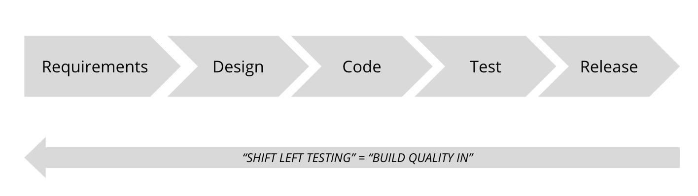

# Ejemplo 2 - Shift left testing

## :dart: Objetivos

- Analizar las diferentes etapas de: planeación, diseño y ejecución
- Reconocer los elementos que componen a la metodología shift left testing

## Desarrollo

Si tuviéramos que escribir la secuencia de actividades en un ciclo de vida de desarrollo de software tradicional (SDLC),
serían: análisis de requisitos, diseño, desarrollo y pruebas, donde las pruebas llegan al final. Como se ve en la
siguiente imagen, Shift left testing (_"cambio de prueba a la izquierda"_) sugiere cambiar las actividades de prueba al
comienzo del ciclo para producir resultados de alta calidad.

Tomemos una analogía para comprender mejor este concepto. Digamos que su equipo está construyendo una nueva casa.
¿Parece sensato completar la construcción por completo y luego verificar la calidad al final de la construcción? ¿Qué
pasa si descubre que las habitaciones no tienen las medidas correctas entonces? ¿Y si no hay espacio para colocar la
puerta? Esos son los problemas que intenta superar el _shift left testing_. El enfoque cree que los
controles de calidad deben comenzar desde la etapa de planificación y continuar durante la fase de desarrollo para que
el producto final sea de la más alta calidad.

Cuando se dice que los controles de calidad deben continuar durante la fase de desarrollo, significa que los controles de
calidad deben repetirse iterativamente para cada pequeña parte del trabajo para que los cambios se puedan incorporar sin
problemas. En la analogía de la construcción de casas, significa hacer controles de calidad para cada pared cuando se
construye para que los problemas se corrijan de inmediato.

Para realizar pruebas tan extensas, _shift left testing_ se basa en gran medida en las pruebas
automatizadas y la integración continua (CI), donde los controles de calidad se automatizan y se ejecutan continuamente
en el CI para cada pequeña parte del trabajo. Esto asegura que la aplicación se pruebe continuamente a menos costo y
esfuerzo que probar manualmente cada pequeña parte del trabajo en busca de múltiples aspectos de calidad.

Para desarrollar esto con más detalle, algunos de los pasos que toman los equipos mientras aplican _shift left testing_
son:

    Escribir pruebas unitarias como parte de cada historia e integrarlas con CI para que se ejecuten en cada commit o push.

    Incluyendo herramientas de linting y complementos para el análisis de código estático durante el desarrollo y también integrándolos con CI.

    Añadiendo pruebas funcionales para cada historia e integrando con CI.

    En general, ejecutar todo tipo de pruebas (unidad, servicio, integración, pruebas de extremo a extremo, etc.) para cada confirmación en la máquina local y CI para garantizar comentarios frecuentes.

Hacerlos garantizará que casi el 50% de las tareas de prueba se completen incluso antes de que el código recién
desarrollado se implemente en el entorno de prueba. En otras palabras, las pruebas se desplazan hacia la izquierda.

Este concepto de incorporar pruebas al principio del ciclo de entrega no se limita solo a las pruebas de aplicaciones
funcionales. Se puede aplicar a las pruebas en general, incluidas las pruebas de seguridad, las pruebas de rendimiento y
otras. Por ejemplo, una de las muchas formas de cambiar las pruebas de seguridad a la izquierda es agregar una
herramienta de escaneo previa a la confirmación como Talisman, que escanea la confirmación en busca de secretos y
alertas, incluso antes de verificar el código. En cada uno de los próximos capítulos, verá enfoques prácticos para
realizar pruebas de desplazamiento a la izquierda.

En general, las pruebas de cambio a la izquierda encarnan el aforismo, 'La calidad es responsabilidad del equipo', ya
que realizar controles de calidad en cada fase del ciclo de vida del desarrollo de software, comenzando por realizar
controles de calidad en los prototipos de diseño de aplicaciones, requisitos, etc., requiere que cada miembro del equipo
poseer pruebas para diferentes aspectos de calidad en colaboración. Algunos ejemplos de cómo la colaboración entre los
miembros del equipo ha demostrado funcionar bien mientras se cambia a la izquierda son: los desarrolladores y los
evaluadores diseñan e implementan juntos la estrategia de prueba; los analistas y probadores refinan juntos la calidad
de los requisitos; los analistas y diseñadores refinan la calidad de los prototipos, etc. Por lo tanto, desarrollar
habilidades de prueba relevantes para realizar varios controles de calidad es vital para todos los roles en un equipo
para entregar software de alta calidad con éxito.
