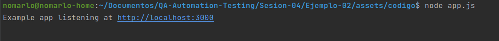

# Ejemplo 2 - Pruebas de integración

## :dart: Objetivos

- Desarrollar un método que utilizando fuerza bruta obtenga la contraseña del usuario
- Implementar pruebas integración

## Desarrollo

Las pruebas de integración dentro del software testing chequean la integración o interfaces entre componentes,
interacciones con diferentes partes del sistema, como un sistema operativo, sistema de archivos y hardware o interfaces
entre sistemas. Las pruebas de integración son un aspecto clave del software testing.

Es esencial que un probador de software tenga una buena comprensión de los enfoques de prueba de integración, para
lograr altos estándares de calidad y buenos resultados. Tipos De Pruebas De Integración Dentro del Sofware Testing

Dentro del software testing existen muchos tipos o enfoques diferentes para las pruebas de integración. Los enfoques más
populares y de uso frecuente son las pruebas de integración Big Bang, las pruebas de integración descendente, las
pruebas de integración ascendente y las pruebas de integración incremental.

La elección del enfoque depende de varios factores como el costo, la complejidad, la criticidad de la aplicación, etc.

Hay muchos tipos menos conocidos de pruebas de integración, como la integración de servicios distribuidos, las pruebas
de integración sándwich, la integración de la red troncal, la integración de alta frecuencia, la integración de capas,
etc.

### Ejercicio

A continuación transformaremos nuestra aplicación en una API. Para ello utilizaremos express. Para instalar express
escribe el siguiente comando en tu terminal:

`npm i express`

Ahora crearemos el archivo `app.js` que fungirá como nuestro router y controllers

`app.js`

```javascript

const express = require('express')
const app = express()
const port = 3000

app.get('/', (req, res) => {
    res.send('Hello World!')
})

app.listen(port, () => {
    console.log(`Example app listening at http://localhost:${port}`)
})

```

Y para iniciar nuestro servidor ejecutamos:

`node app.js`



Ahora crearemos una prueba para este código. Primero utilizaremos _axios_ para realizar nuestras peticiones http,
podríamos utilizar la librería incluida en node, pero _axios_ nos facilitará el trabajo. Para instalar _axios_
ejecutaremos el siguiente comando: `npm install axios`

Y a continuación crearemos nuestra prueba

`TestApp.js`

```javascript
const axios = require('axios');

const executeTest = async (input, expectedOutput, functionToExecute) => {
    const actualOutput = await functionToExecute(input)

    if (actualOutput !== expectedOutput) {
        console.log(`Test fail. Expected output: ${expectedOutput}  actual output: ${actualOutput}`)
    } else {
        console.log("Test pass")
    }
}

const makeApiCall = async () => {
    const response = await axios.get('http://localhost:3000')
    return response.data
}

const testReturnsHelloWorld = async () => {
    const expectedMessage = "Hello World!"
    await executeTest({}, expectedMessage, makeApiCall)
}


testReturnsHelloWorld();

```
