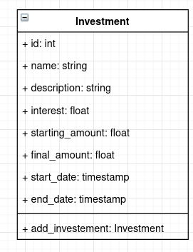

# Ejemplo 1 - Modelo de datos

## :dart: Objetivos

- Aplicar el patrón AAA (Arrange -  Act - Assert)
- Aplicar el patrón GWT (Given - When - Then)

## ⚙ Requisitos

- WebStorm
- Node.js
- Jest

## Desarrollo

Como revisamos en el prework, la empresa sistemas ABC desea realizar un sistema que permita a los usuarios llevar
control de sus inversiones. A continuación se describen algunas historias de usuario

- Un usuario podrá dar de alta inversiones a plazo fijo como: bonos bancarios, bonos de gobierno, etc.
- Las inversiones contarán con al menos la siguiente información: identificador, nombre. monto y plazo

A continuación describiremos el modelo de datos que utilizaremos



Crearemos una carpeta llamada

`investments-be`

Dentro de ella inicializaremos un nuevo repositorio

Y ahora inicializaremos un nuevo paquete un nuevo paquete de npm

`npm init -y`

Instalamos jest

`npm install --save-dev jest`

¿Qué historia de uso y criterios de definición desarrollaste para esta funcionalidad durante el prework?

### Historia de usuario

**AS** un usuario
**I WANT** poder registrar mis inversiones de plazo
**SO** puedo tenerlas registradas en un solo lugar

### Criterios de aceptación

**GIVEN** un usuario
**WHEN** ingresa los datos: nombre, descripción, interes, monto, fecha de inicio y duración en días
**THEN** se crea un registro de esta nueva inversion

**GIVEN** una nueva inversion
**WHEN** se cuenta con fecha de inicio y duración en días
**THEN** se calcula la fecha de finalización

**GIVEN** una nueva inversion
**WHEN** se cuenta con el interes, monto y duración
**THEN** se calcula el monto final

Creemos el caso de uso que cubre nuestro segundo criterio de aceptación

`TestInvestment.spec.js`

```javascript
const Investment = require("../../entities/Investment");

describe('Investment', () => {
    describe('Add new investment', () => {
        it('calculates end date based on initial day plus duration', () => {
            const name = "cetes 28 days";
            const description = "cetes for 28 days";
            const interest = 4.5;
            const startingAmount = 10;
            const durationDays = 28;
            const startDate = new Date('2021-01-01');
            const endDate = new Date('2021-01-29');

            const investment = Investment.addInvestment(name, description, interest, startingAmount, startDate, durationDays);

            expect(investment.endDate).toEqual(endDate);
        })


    })

})

```

Y ahora nuestra implementación para pasar la prueba.

`Investment.js`

```javascript
class Investment {
    id;
    name;
    description;
    interest;
    startingAmount;
    finalAmount;
    startDate;
    endDate;

    constructor(id, name, description, interest, startingAmount, finalAmount, startDate, endDate) {
        this.id = id;
        this.name = name;
        this.description = description;
        this.interest = interest;
        this.startingAmount = startingAmount;
        this.finalAmount = finalAmount;
        this.startDate = startDate;
        this.endDate = endDate;
    }

    static addInvestment(name, description, interest, startingAmount, startDate, duration) {
        const endDate = startDate;
        endDate.setDate(endDate.getDate() + duration);
        return new Investment(1, name, description, interest, startingAmount, 0, startDate, endDate)
    }
}


module.exports = Investment;


```
