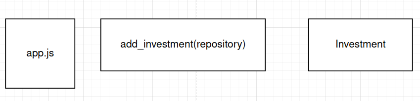

# Reto 2 - Inyección de dependencias

## :dart: Objetivos

- Identificar las características del principio de Inversión de control
- Aplicar el patrón de Inyección de dependencias

## ⚙ Requisitos

- WebStorm
- Node.js
- Jest
- sqlite3

## Desarrollo

A continuación nos desacoplaremos del framework(express) y para ello crearemos las siguientes clases/archivos.



- Crea el archivo add_investment e impleméntalo como una función o una clase
- Crea las pruebas correspondientes inyectando una implementación del repositorio o una conexión a la BD.

<details>
  <summary>Solución</summary>

1. La función `add_investment` recibe como parámetro una instancia de nuestro repositorio, lo que nos permite poder
   inyectar esta dependencia
2. En nuestras pruebas podemos inyectar un mock, stub o una implementación real (con conexión a la base de datos) de nuestro repositorio. 

`add_investment.js`

```javascript

import Investment from "./investment-be/entities/Investment";

const AddInvestmentRequest = function (name, description, interest, startingAmount, durationDays, startDate) {
    this.name = name;
    this.description = description;
    this.interest = interest;
    this.startingAmount = startingAmount;
    this.durationDays = durationDays;
    this.startDate = startDate;
}

const add_investment = (addInvestmentRequest, repository) => {
    return Investment.addInvestment(addInvestmentRequest.name, addInvestmentRequest.description, repository)
}

```

</details>
