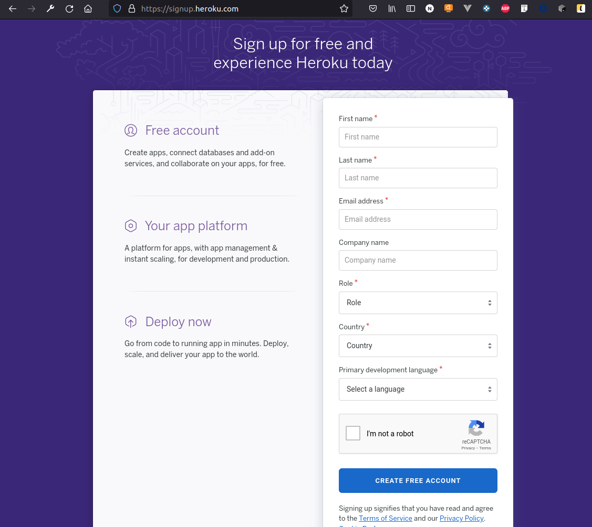

# Ejemplo 1 - Platform as a Service (PaaS)

## :dart: Objetivos

- Identificar las características del desarrollo y la integración continua.
- Aplicar principios de DevOps para la construcción de pipelines

## ⚙ Requisitos

- WebStorm
- Node.js
- Jest
- Una cuenta de heroku

## Desarrollo

PaaS es un conjunto de servicios para crear y administrar aplicaciones modernas en la era digital, tanto en las
instalaciones locales como en la nube.

PaaS ofrece la infraestructura y los componentes de middleware que permiten a los desarrolladores, administradores de TI
y usuarios finales construir, integrar, migrar, implementar, proteger y administrar aplicaciones móviles y web.

Para ayudar a la productividad, PaaS ofrece componentes de programación listos para usar que les permiten a los
desarrolladores crear nuevas capacidades en sus aplicaciones, incluidas tecnologías innovadoras como inteligencia
artificial (IA), chatbots, blockchain e Internet of Things (IoT). Esto también abarca suites de herramientas de
desarrollo de aplicaciones, lo que incluye servicios nativos en la nube, Kubernetes, Container Engine, Kubernetes y más.

Los servicios de PaaS también ofrecen soluciones para analistas, usuarios finales y administradores profesionales de TI,
entre ellas, análisis de big data, administración de contenido, administración de datos y bases de datos, administración
de sistemas y seguridad en la nube.

PaaS proporciona todos los beneficios fundamentales del cómputo en la nube, desde precios transparentes y
aprovisionamiento inmediato hasta escalabilidad a pedido y recuperación ante desastres, todo administrado de manera
consistente a través de paneles de control fáciles de usar. Como resultado, las empresas pueden:

    Estandarizar y simplificar las operaciones de TI
    Acelerar la innovación empresarial con soluciones listas para usar
    Reducir los riesgos operativos, de seguridad y de gobierno

### Heroku

A continuación desplegaremos nuestros repositorios en heroku

Nos dirigiremos a [https://www.heroku.com/](https://www.heroku.com/)


Y crearemos una nueva cuenta dando clic en Sign up



A continuación damos en click en New y click en Create new app


Añadimos un nombre y damos clic en `Create app`


Para indicarle a heroku la versión de node.js a utilizar necesitamos añadir el siguiente código en nuestro
archivo `package.json`

```
"engines": {
    "node": "14.x"
  },
```

Ahora modificaremos la sección `scripts` añadiendo un script llamado `run`

```
"scripts": {
    "test": "echo \"Error: no test specified\" && exit 1",
    "start": "node server.js"
  },
```

El resultado final de nuestro archivo `package.json` es:

```json
{
  "name": "assets",
  "version": "1.0.0",
  "description": "",
  "main": "index.js",
  "scripts": {
    "test": "echo \"Error: no test specified\" && exit 1",
    "start": "node server.js"
  },
  "keywords": [],
  "author": "",
  "license": "ISC",
  "devDependencies": {
    "jest": "^27.2.1"
  },
  "engines": {
    "node": "14.x"
  },
  "dependencies": {
    "express": "^4.17.1",
    "sqlite3": "^5.0.2",
    "supertest": "^6.1.6",
    "uuid": "^8.3.2"
  }
}


```
A continuación heroku seleccionaremos la opción: conectar con GitHub


Ahora seleccionamos nuestro repositorio y damos clic en connect


Ahora habilitamos los despliegues automaticos 


Y por último damos clic en el despliegue de nuestra rama


