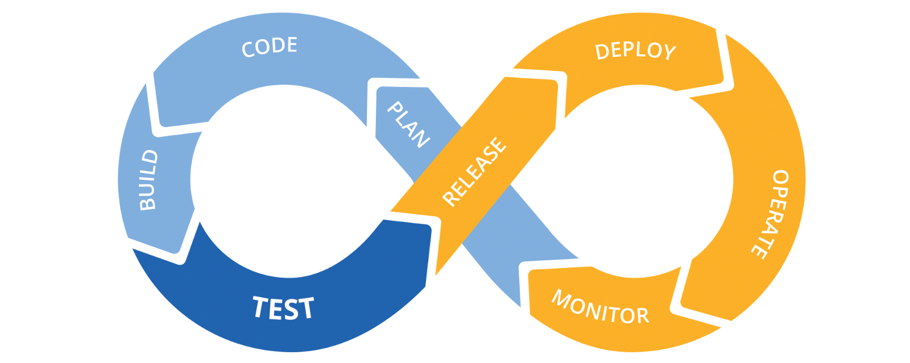

# Ejemplo 2 - CI/CD

## :dart: Objetivos

- Identificar las características de Jenkins, Travis y Github Actions
- Crear un pipeline con GitHub Actions

## ⚙ Requisitos

- WebStorm
- Node.js
- Jest
- Una cuenta de GitHub

## Desarrollo

### CI/CD

La integración y la entrega continua (CI y CD, respectivamente) encarnan una cultura, principios y prácticas que
permiten a los desarrolladores de aplicaciones entregar cambios de código de manera más frecuente y fiable.

CI/CD es una de las mejores prácticas que pueden implementar los equipos de desarrollo. También es una práctica
recomendada de metodología ágil, ya que permite a los equipos de desarrollo de software centrarse en cumplir los
requisitos comerciales, la calidad del código y la seguridad, porque los pasos de implementación están automatizados.

La integración continua (CI) es una filosofía de codificación y un conjunto de prácticas que impulsan a los equipos de
desarrollo a implementar con frecuencia pequeños cambios y registrar el código en los repositorios de control de
versiones. Como la mayoría de las aplicaciones modernas requieren desarrollar código en diferentes plataformas y
herramientas, el equipo necesita un mecanismo para integrar y validar los cambios.

El objetivo técnico de CI es establecer una forma coherente y automatizada para crear, empaquetar y probar aplicaciones.
Con coherencia en el proceso de integración, es más probable que los equipos acometan cambios de código con mayor
frecuencia, lo que llevará a una mejor colaboración y calidad del software.

La entrega continua (CD) comienza donde termina la integración continua. CD automatiza la entrega de aplicaciones a
determinados entornos de infraestructura. La mayoría de los equipos trabajan con múltiples entornos además de la
producción, como los entornos de pruebas y desarrollo, y CD garantiza que haya una forma automatizada de enviarles los
cambios de código.

Las herramientas de CI/CD ayudan a almacenar los parámetros específicos del entorno que deben empaquetarse con cada
entrega. La automatización de CI/CD realiza las llamadas de servicio necesarias a los servidores web, bases de datos y
otros servicios que pueden necesitar reiniciarse o seguir otros procedimientos cuando se implementen las aplicaciones.

La integración continua y la entrega continua requieren pruebas continuas, porque el objetivo es entregar aplicaciones y
código de calidad a los usuarios. Las pruebas continuas a menudo se implementan como un conjunto de regresión
automatizada, rendimiento y otras pruebas que se ejecutan en la canalización CI/CD.

Una práctica devops CI/CD madura tiene la opción de llevar a cabo una implementación continua donde los cambios en la
aplicación se ejecuten a través de la canalización CI/CD y las versiones correspondientes se implementen directamente en
los entornos de producción. Los equipos que practican la entrega continua optan por desplegarlas en la producción en un
flujo diario o incluso por horas, aunque la entrega continua no siempre es óptima para todas las aplicaciones
comerciales.
