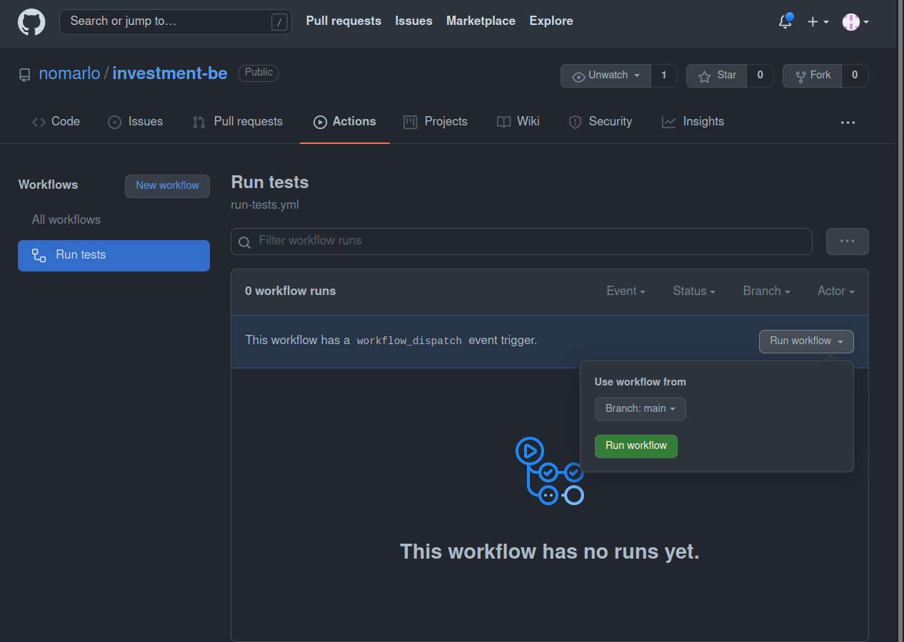

# Ejemplo 3 - CI/CD con GitHub Actions

## :dart: Objetivos

- Identificar las características de Jenkins, Travis y Github Actions
- Crear un pipeline con GitHub Actions

## ⚙ Requisitos

- WebStorm
- Node.js
- Jest
- Una cuenta de GitHub

## Desarrollo

La Integración Continua es una práctica que nos requiere añadir frecuentemente nuevo código a un repositorio compartido
para detectar errores a la mayor brevedad posible. Para ello Github propuso en 2018 no solo alojar nuestro código en sus
repositorios como hemos hecho siempre, sino que además la posibilidad de automatizar los distintos pasos de compilación
y test de nuestros proyectos (al igual que ya tenía implementado Gitlab).

Para ello Github Actions ha creado el concepto de workflow el cual es el encargado principal de todo nuestro proceso o
Pipeline. Se puede configurar de manera que Github reaccione a ciertos eventos (por ejemplo cuando se hace un nuevo push
a una rama), automáticamente de forma periódica o por eventos externos. Especificando en dicho workflow que se analicen
los componentes del proyecto, una vez terminados se mostrarán los resultados de los mismos y se podrá comprobar si el
cambio en dicha rama ha producido algún error o ha ido todo bien. Este mismo es ejecutado en un runner o instancia en un
servidor y Github te da la posibilidad de utilizar un runner hosteado por Github o añadir un host propio.

Para entender bien en qué consiste un workflow, el siguiente esquema muestra las partes que lo componen.


**Workflow**: como ya hemos comentado anteriormente, es un procedimiento automatizado el cual se añade a un repositorio.
Con él se puede hacer el build, test, package, release o deploy de un proyecto dentro de Github.

**Job**: es un conjunto de steps que se ejecutan en runner de nuestro proceso.

**Step**: es una tarea individual que puede ejecutar comandos dentro de un job. Un job está formado por uno o más steps
y éstos están ejecutados sobre el mismo runner a la hora de ejecutarse el workflow.

**Action**: Son los comandos de ejecución del proceso, ejecutados en un step para crear un job. Son el bloque de
construcción más pequeño que hay. Puedes crear tus propios actions o utilizar algunos de ellos que ya están creados por
la comunidad de Github. Obligatoriamente para utilizar un action en un workflow, éste debe ir incluido en un step.

## GitHub Action para ejecutar tests

En nuestro archivo `package.json` modificaremos nuestro script de test: `"test": "jest",`

```json
{
  "name": "assets",
  "version": "1.0.0",
  "description": "",
  "main": "index.js",
  "scripts": {
    "test": "jest",
    "start": "node server.js"
  },
  "keywords": [],
  "author": "",
  "license": "ISC",
  "devDependencies": {
    "jest": "^27.2.1"
  },
  "engines": {
    "node": "14.x"
  },
  "dependencies": {
    "express": "^4.17.1",
    "sqlite3": "^5.0.2",
    "supertest": "^6.1.6",
    "uuid": "^8.3.2"
  }
}


```

En nuestro repositorio crearemos el siguiente archivo

`.github/workflows/run-tests.yml`

```yaml

name: Run tests

on:
  push:
    branches: [ main ]
  pull_request:
    branches: [ main ]

  # Allows you to run this workflow manually from the Actions tab
  workflow_dispatch:

jobs:
  run-tests:
    runs-on: ubuntu-latest

    steps:
      - name: Checkout repository
        uses: actions/checkout@v2

      - name: Install node
        uses: actions/setup-node@v2
        with:
          node-version: '14.16'
          
      - name: Install dependencies
        run: npm install

      - name: Run tests
        run: npm run test
```

Ahora en nuestro repositorio de GitHub nos dirigiremos a la sección de `Actions`


Y ejecutaremos nuestro workflow




Si todo va bien deberíamos ver algo como esto:


